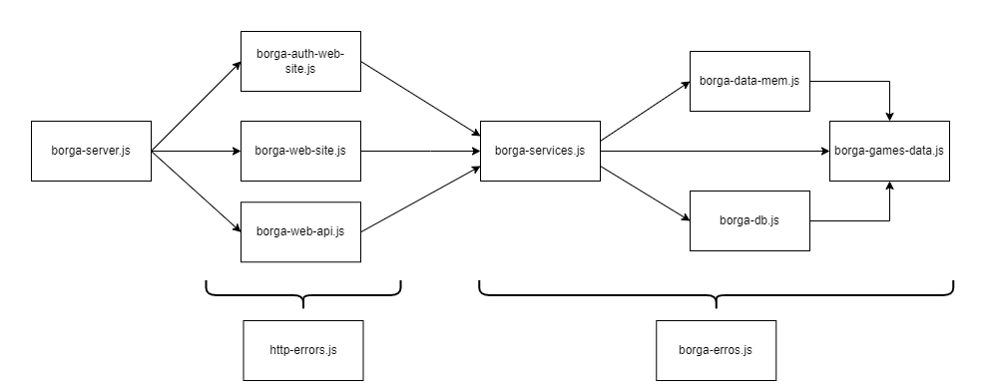

<div align="center">
 <h1>Borga Web App</h1>
 <p style="font-size: 1rem; margin-top: 1rem;"><a href="https://isel-pi-leirt-2122-1-g02r.herokuapp.com/" target="_blank">https://isel-pi-leirt-2122-1-g02r.herokuapp.com/</a></p> 
</div>

## 🚀 Mãos a obra

1.  **Instalações necessarias para para executar a aplicação.**

    ```shell
    # Criar package.json
        npm init –y
    ```

    ```shell
    # Módulo que contém a Fetch API do node
        npm install node-fetch
    ```

    ```shell
    # Framework Express
        npm install express
    ```

    ```shell
    # Middlewares
        npm install express-session
        npm install passport
    ```

    ```shell
    # Extensões para utilizar template engines no web-site
        npm install handlebars
    ```

    ```shell
    # Framework para testes
        npm install jest --save-dev
        npm install supertest --save-dev
    ```

2.  **O proximo passo é abrir o ficheiro package.json e mudar a propriedade do campo test para "jest". Agora estamos prontos para executar os testes da aplicação.**

    Navegue para a diretoria base e execute!

    ```shell
      npm run test
    ```

3.  **Escolha a maneira como deseja guardar os dados.**

    Abra o ficheiro borga-server.js e comente a opção que não deseja utilizar.

    ```shell
    # Memory
      const borgaData = require('./borga-data-mem.js')

    # ElasticSearch
      const borgaData = require('./borga-db.js')

    ```

4.  **ElasticSearch**

    Se utilizar o ElasticSearch será necessario tê-lo instalado previamente para executar alguns comandos no shell para criar os documentos necessarios para o funcionamento da aplicação. Caso não tenha instalado o Curl deve considerar em faze-lo para o gerenciamente das contas criadas na aplicação.

    <a href="https://www.elastic.co/pt/downloads/elasticsearch" target="_blank">Install ElasticSearch.</a><br/>
    <a href="https://curl.se/download.html" target="_blank">Install Curl.</a>

    ```shell
    # Executar o ElasticSearch
      elasticsearch
    ```

    ```shell
    # Deletar para prevenir "data overlap"
      curl -X DELETE http://localhost:9200/users
      curl -X DELETE http://localhost:9200/groups
    ```

    ```shell
    # Inserir ambos no curl
      curl -X PUT http://localhost:9200/users
      curl -X PUT http://localhost:9200/groups
    ```

    ```shell
    # Crie uma conta admin
      curl -X POST --data "{\"userName\" : \"admin\", \"password\" : \"admin\", \"token\" :\"3fa85f64-5717-4562-b3fc-2c963f66afa6\" }" -H "Content-Type: application/json"             http://localhost:9200/users/_doc
    ```

    ```shell
    # Crie um grupo para o admin
    curl -X POST --data "{\"name\" : \"MyGroup\",  \"description\" : \"Administration Group\", \"games\" : [], \"userName\" : \"admin\" }" -H  "Content-Type: application/json"       http://localhost:9200/groups/_doc
    ```

5.  **Executar a aplicação**

    Abra o shell na diretoria base da aplicaçãoo e vamos começar!

    ```shell
      node borga-server.js
    ```

    O seu site agora está a correr no <a href="https://curl.se/download.html" target="_blank">http://localhost:8080</a><br/><br/>

## :computer: Aplicação Web

Esta aplicação foi desenvolvida em um modelo de hierarquia de blocos, onde cada um destes possui um ou mais módulos, responsáveis por uma etapa específica na manipulação da informação, facilitando assim a identificação de possíveis erros de forma a ser possível tratá-los. Para uma melhor percepção desta hierarquia foi construído o seguinte esquema:

<br/>



<br/>

## Borga-Server

Os tratamentos das rotas base da aplicação tanto para o web-site como para a autenticação e para a Api, são realizados neste módulo, onde é inicializada uma “app” com a framework Express. Neste foi necessario utilizar middlewares tais como:
Express.json(), que permite a parcelização de pedidos com informação em json.
Express.urlencoded(), que parceliza a informação dos pedidos em queryStrings ao passar o parametro extended com o valor false.
Express.static(), para utilizar arquivos estáticos, como imagens, CSS e JavaScript.
Na construção da hierarquia, foi utilizada injeção de dependências, de modo a delegar a cada módulo as funções necessárias ao seu funcionamento.

## Borga-Auth-Web

Este modulo é responsável pela autenticação do utilizador e disponibiliza a este a opção de fazer login e logout. Para manter sessão visto que o HTTP é um protocolo stateless é utilizado o Passport que faz a serialização e descerialização de todo o processo, utilizando os métodos: serializeUser() função que mantem os dados do usuário (após a autenticação bem-sucedida) na sessão. A função deserializeUser() utilizada para recuperar dados do usuário da sessão, fazendo o papel de um cookie.

## Borga-Web-Site

Este módulo tem como função realizar as operações HTTP de “GET” e “POST” com a finalidade de renderizar o respetivo html com os dados obtidos com recurso aos módulos subsequentes, enviando esta renderização para o cliente de forma a criar a página web. Para a realização destas operações, são adicionadas rotas correspondentes a cada tipo de manipulação dos dados, como criar um utilizador, um grupo, ou obter páginas que irão auxiliar a realização destes pedidos.

## Borga-Web-Api

Tal como o módulo Borga-Web-Site, este é responsável por realizar operações HTTP, contudo, neste são incluídos também pedidos de “PUT” e “DELETE” e as respetivas rotas. A finalidade deste módulo, ao contrário do Web-Site, é retornar na resposta http os correspondentes dados em json.

## Borga-Services

Este módulo é essencial para o funcionamento de toda a aplicação, uma vez que é o elo de ligação entre os módulos responsáveis pelo HTTP e os módulos responsáveis pela manipulação dos dados guardados.

## Borga-Games-Data

Responsável por realizar os pedidos dos jogos à API Board Game Atlas, tendo como possibilidade passar um id ou um nome. O pedido é limitado a 10 jogos, e ordenado por “fama”, sendo possível obter os 10 mais famosos de toda a API caso nada seja passado como parâmetro, ou os 10 mais famosos com certo nome. O pedido a partir do ID retorna um único jogo.

## Borga-Data-Mem / Borga-DB

O propósito destes módulos é o acesso a toda a informação dos dados, ou guardados em memória ou na base de dados do elastic, de forma a conseguir manipular os mesmos de acordo com o pretendido.

## Estruturas de dados

**Users**
<br>
A estrutura de dados user representa o utilizador da aplicação. Esta é composta por um identificador, que foi determinado como sendo o seu nickname (nome do utilizador), e de forma a registar-se, existe um campo password que é responsável por guardar a senha do mesmo. Por fim, no ato de registo é gerado um token, que será utilizado na autenticação do utilizador no acesso aos recursos. O campo nickname visto se tratar do identificador do objeto, este tem de ser unico, ou seja, não é possivel existirem dois nicknames iguais.

**Groups**
<br>
O objeto que representa os grupos pode ser identificado de 2 formas distintas: Em caso de memória como um numero que será incrementado à medida que os mesmos são criados, ou no caso da utilização do ElasticSearch como uma string gerada pelo mesmo, ficando o identificador armazenado na propriedade groupId. Na criação de um grupo o utilizador tem dois campos a preencher, o nome que pretende atribuir ao grupo, sendo este obrigatório à sua criação e uma descrição opcional do que o grupo retrata. Este objeto contém ainda um array que irá posteriormente guardar os jogos que o utilizador pretende adicionar ao grupo.

**Games**
<br>
Como referido anteriormente o utilizador tem a opção de adicionar vários jogos a um grupo,estes jogos são adquiridos a partir da API bordgameAltas e de onde são guardados as seguintes propriedades: a imagem correspondente ao jogo, o seu identificador, o nome e a descrição do mesmo, os tipos de mecanicas que o jogo envolve, as categorias em que este está inserido e o Url que redireciona o utilizador para a pagina da API correspondente ao jogo.

## :european_post_office: Team

**LEIRT51D**
<br>
Developed by Students:

<ul>
  <li> Gustavo Campos A47576
  <li> Tiago Cebola A47594
  <li> Inês Sampaio A47758
</ul>
